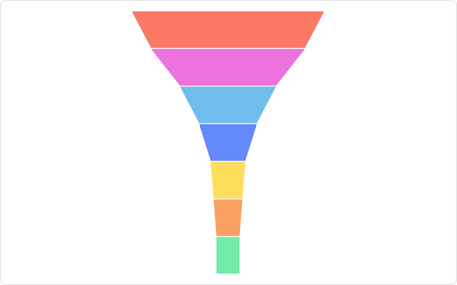

# Funnel Chart Mod for Spotfire®

Display streamlined data; each slice in the funnel representing a process that has filtered out data.

## Installation & Use

[Download latest version](https://github.com/spotfiresoftware/spotfire-mod-funnel/releases)

The [Wiki](https://github.com/spotfiresoftware/spotfire-mod-funnel/wiki) contains step-by-step instruction on how to install and use this Mod in Spotfire®.

## Building the Project

The build task will create an compressed JavaScript bundle. 

In a terminal window:
- `npm ci`
- `npm run build`

The funnel chart will be found under `dist`.

### Bundle for production

The `build-watch` task will create an uncompressed JavaScript bundle to simplify development and debugging. When the mod is ready to be saved into the analysis file the JavaScript bundle should be compressed. By invoking `npm run build`, `esbuild` will create a minified bundle.

In a terminal window:
- `npm ci`
- `npm run build-watch`

In a new terminal window:
- `npm run server`

### Unit tests

Invoking `npm test` will start a test runner.

## About Mods for Spotfire®
-   [Spotfire Community Exchange](https://community.spotfire.com/files/): A safe and trusted place to discover ready-to-use Mods
-   [Developer documentation](https://spotfiresoftware.github.io/spotfire-mods/docs/): Introduction and tutorials for Mods developers
-   [Mods examples](https://github.com/TIBCOSoftware/spotfire-mods/): A public repository for examples projects
